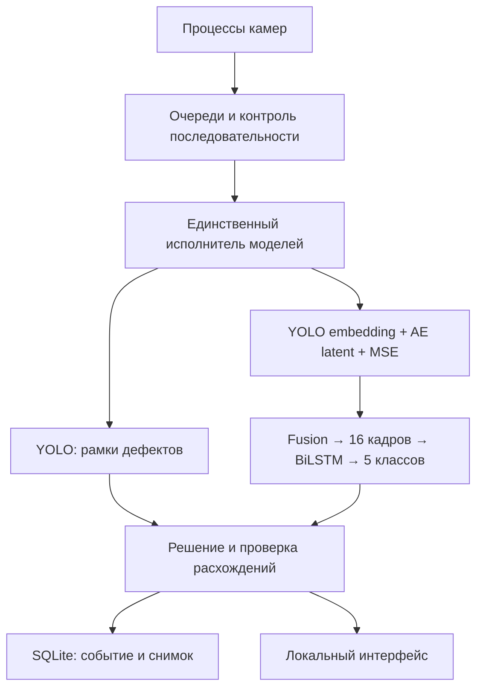

# ReaperGrasp

Локальное приложение контроля дефектов поверхности. Основано на архитектуре отчёта и проектах SymplysoF DetectionDefects / HarvesterVisualizer. Это проверяемая инженерная версия, а не аттестованная система промышленного контроля.

## Запуск

Linux x86-64, Python 3.11–3.12. Проверено в среде Python 3.12 на CPU.

```bash
python3 -m venv .venv
.venv/bin/python -m pip install --upgrade pip==25.2
.venv/bin/pip install torch==2.8.0 torchvision==0.23.0 --index-url https://download.pytorch.org/whl/cpu
.venv/bin/pip install -r requirements.txt
.venv/bin/python tools/fetch_assets.py
.venv/bin/python -m reapergrasp --demo --cpu
```

Открыть http://127.0.0.1:8010. Без `--demo` приложение ищет USB/V4L2-камеры и повторяет обнаружение каждые 3 секунды. Демонстрация никогда не включается вместо отсутствующей камеры автоматически. RTSP-камеры и ROI задаются в разделе настроек; логин/пароль IP-камеры нельзя автоматически угадать.

`tools/fetch_assets.py` нужен при подготовке сборки: загружает модели и 32 демонстрационных кадра из зафиксированного коммита и проверяет SHA-256. При работе приложение не скачивает модели, не использует CDN, облачный API или внешнюю БД. Workflow **Verify and bundle** собирает исходники, веса, кадры и wheelhouse Python-зависимостей в архив `ReaperGrasp-offline-cpu-py311`. Проверенные пакеты публикуются в [Releases](https://github.com/Mika-dot/ReaperGrasp/releases). После успешной сборки архив устанавливается через `bash tools/install-offline.sh` без сети на Linux x86-64 с Python 3.11, venv, libGL и libglib2. Это пакет приложения, а не установщик ОС. Сборка исходников требует интернет.

Для NVIDIA используйте вместо CPU-пакетов сборку Torch с CUDA (`https://download.pytorch.org/whl/cu128`) и совместимый драйвер. В режиме `auto` выполняется пробная операция на CUDA, затем загрузка модели. При ошибке GPU приложение переходит на CPU и сбрасывает историю. CPU-сборка Torch не может использовать GPU. AMD/Intel GPU не реализованы.

## Поведение

- Каждый захват работает в отдельном завершаемом процессе. Между процессами передаётся сжатое изображение (для камер JPEG quality 95, для демонстрации исходный файл), чтобы большие кадры не забивали IPC. Ограниченная очередь, счётчик потерь, тайм-аут и переподключение.
- Один поток владеет моделями; история каждой камеры независима. После пропуска, переподключения или повтора демонстрации окно сбрасывается.
- До 16 последовательных кадров состояние «Накопление», а не «Норма».
- YOLO-блоки и temporal-классификация сохраняются раздельно. При обнаружении YOLO и низком temporal-score показывается «Нужна проверка».
- Устаревшие данные, отсутствие камеры, ошибка анализа, ошибка записи и перегрузка видны в GUI.
- SQLite WAL: результат и JPEG записываются одной транзакцией. По умолчанию хранение 30 дней / 10000 событий, защитный остаток диска 256 MiB. Повторные сигналы одной камеры сохраняются не чаще раза в 2 секунды; это журнал снимков, не подсчёт отдельных физических дефектов.
- Настройки сохраняются атомарно и применяются с перезапуском анализа. HTTP слушает только loopback; изменение настроек требует same-origin запроса.

Данные: `~/.local/share/reapergrasp/`, либо `REAPERGRASP_STATE_DIR`. На kiosk — `/var/lib/reapergrasp`. Не удаляйте БД при обновлении приложения.

Стартовый режим 2 кадра/с на камеру выбран для CPU-демонстрации. Для движущегося материала частоту, выдержку, масштаб, ROI и скорость линии необходимо согласовать с обучающими данными и требуемым минимальным дефектом. Снижение частоты не доказывает сплошное покрытие поверхности. Калибровки сшивки камер и управления машиной в этой версии нет.

## Архитектура



Сохранена совместимость с исходным checkpoint. Необученная контекстная YOLO-head и embedding projection исключены из обучения / использования, но их ключи сохранены для загрузки весов. Отдельный детектор и backbone полного checkpoint имеют разные веса: их нельзя произвольно объединять без переобучения.

## Проверки

```bash
.venv/bin/pip install pytest==8.3.5 httpx==0.28.1
.venv/bin/python -m pytest -q tests
.venv/bin/python tools/replay_check.py
.venv/bin/python tools/service_check.py
```

Локально прошли 19 тестов и полный прогон двух демонстрационных камер без потерь, с записью двух событий и корректным завершением процессов. Результаты настоящего inference: `docs/validation-replay.json`; полный сервис: `docs/validation-service.json`, когда соответствующая проверка завершена. Эти прогоны проверяют работоспособность и регрессии, а не точность на производстве. Аудит исходной архитектуры: `docs/INITIAL_AUDIT.md` и `docs/prior-evidence/`.

На записанной camera_0 temporal даёт `garbage`, YOLO — `point`; на camera_1 temporal склоняется к `normal`, YOLO — `foreign`. Вторая ситуация больше не отображается зелёной нормой. Значения softmax не объявляются калиброванными вероятностями дефекта.

Для обработки отдельной записанной последовательности используется тот же механизм решений: `python pipeline_runner.py --input examples/replay/camera_1 --output replay-output --device cpu`. Номера кадров в именах должны идти по порядку. Смена сцены должна разделяться на разные каталоги.

## Обучение без утечки

`dataset.py` требует `workspace/data/recordings.json`. Разделение train/val задаётся по физическому прогону/катушке (`group`), до формирования окон. Все камеры одного прогона должны иметь одинаковый group. Один объект записи содержит одну непрерывную последовательность одной камеры с одной меткой. Переходы классов следует размечать и разрезать отдельно. Смешение групп и одинакового содержимого кадров между выборками запрещено; окна не пересекают пропущенные номера.

```json
[{"group":"coil-001","split":"train","label":4,"frames":[{"index":0,"path":"coil-001/camera-0/0.jpg"}]}]
```

Нужно минимум 16 кадров в каждой последовательности и непустые train/val. Пример выше демонстрирует формат, сам по себе недостаточен. Классы: `connection, foreign, garbage, point, normal`. Геометрическая и яркостная аугментация общая на окно. Исходный дефектный random split перекрывающихся окон заменён. Новые веса не обучались: размеченного набора отдельных производственных прогонов нет.

## Linux appliance

На выделенном Debian 12 amd64:

```bash
sudo bash linux/install.sh --kiosk cpu
```

Установщик создаёт пользователя без shell, ставит приложение в `/opt/reapergrasp`, включает systemd-перезапуск backend и Cage+Chromium, отключает обычные VT getty и переводит загрузку в режим без рабочего стола. `cuda` вместо `cpu` устанавливает CUDA-вариант Torch; драйвер GPU устанавливается отдельно под целевое железо. Не запускать установщик на рабочем компьютере: он меняет режим входа и загрузки.

`linux/build-iso.sh` и workflow **Build experimental Debian ISO** — рецепт экспериментального CPU live ISO с Debian Installer и поддержкой persistence. Нужен привилегированный сборщик с mount/chroot. Сборка и загрузка ISO на реальном ПК ещё не подтверждены. Live-режим без настроенного persistence не сохраняет журнал после перезагрузки; для постоянной эксплуатации требуется установка на диск или подготовленный persistence-раздел. Автоматического форматирования дисков нет.

Cage запускает единственное полноэкранное приложение без desktop. Политики Chromium блокируют внешнюю навигацию, инструменты разработчика и скачивания. Это kiosk для оператора, не защита от физического доступа к загрузчику/носителю. Аварийное обслуживание — администратором через отдельную загрузочную среду.

## Источники

- [DetectionDefects](https://github.com/SymplysoF/DetectionDefects/tree/97483725e12cadf3e5be452c468075959837a025)
- [HarvesterVisualizer, исходники и веса](https://github.com/SymplysoF/HarvesterVisualizer/tree/70410a054a6e6bc96e8c2b3c4c9935f9ade4c1a6)
- [Cage](https://github.com/cage-kiosk/cage), [Debian Live Manual](https://live-team.pages.debian.net/live-manual/html/live-manual/index.en.html)

Авторство исходных компонентов сохранено. Условия сторонних зависимостей и исходных весов не заменяются лицензией этого репозитория.
