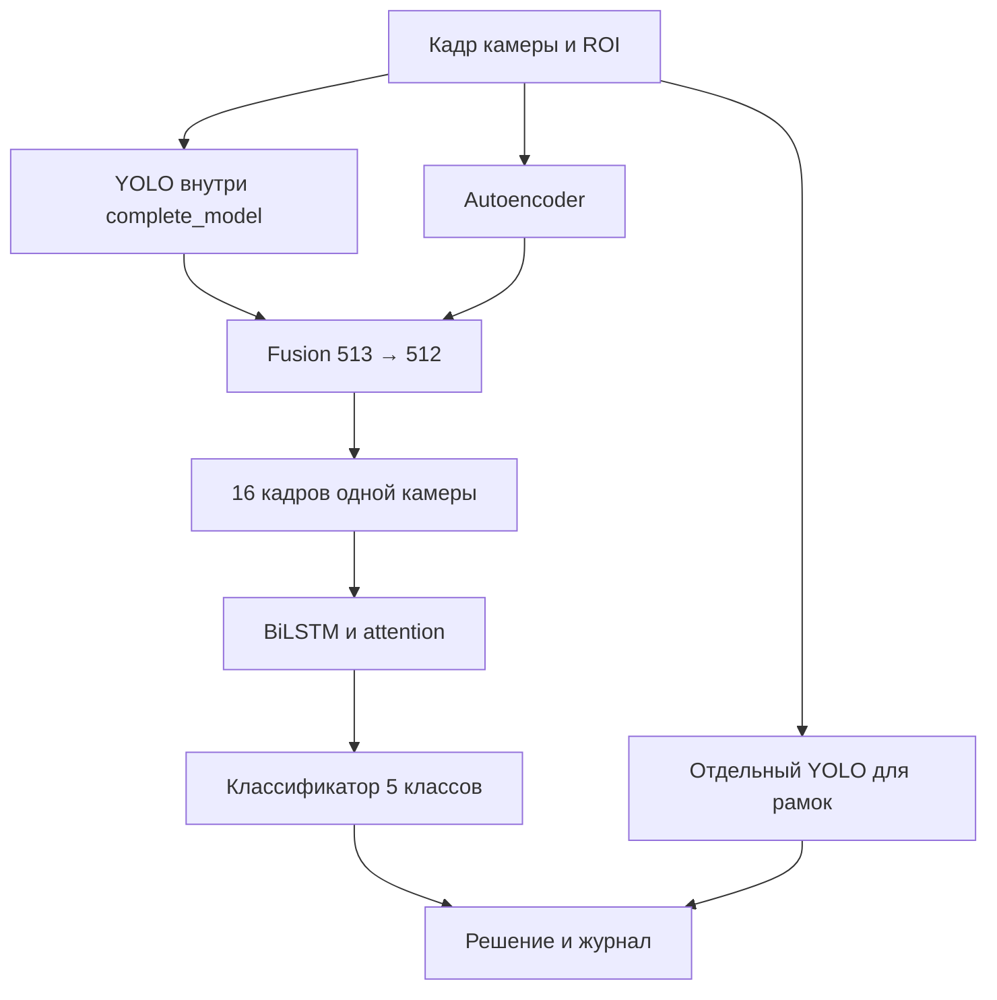

> Исторический аудит исходных проектов и первого исследовательского пакета. Описанные ниже 7 тестов и времена относятся к тому пакету; текущая реализация и её проверки описаны в README ReaperGrasp.

# Проверка архитектуры контроля дефектов кабеля

Дата проверки: 9 сентября 2026 года.

**Вывод: исследовательская идея жизнеспособна, демонстратор можно запускать, но текущая система не готова управлять производственной линией.** Загрузка настоящих весов и обработка кадров воспроизведены. Найдены ошибки запуска, поведения потоков, формирования датасета и интерпретации результатов. Ошибки демонстратора исправлены в приложенном коде. Качество распознавания после переобучения ещё предстоит подтвердить.

## Источники и границы проверки

Изучены текст и все восемь изображений из приложенного `Отчет.docx`, все доступные исходные Python-файлы обеих основных веток, настройки, шаблоны интерфейса и опубликованные JSON-результаты. Из HarvesterVisualizer получены три файла весов и два клипа по 16 изображений. Кадры этих двух клипов частично совпадают; это не 32 независимых контрольных примера.

Зафиксированные версии:

| Источник | Ветка | Commit SHA |
|---|---|---|
| SymplysoF/DetectionDefects | master | 97483725e12cadf3e5be452c468075959837a025 |
| SymplysoF/HarvesterVisualizer | main | 70410a054a6e6bc96e8c2b3c4c9935f9ade4c1a6 |

Исходные веса не изменялись и не переобучались. Проверка выполнена на Linux, Python 3.12.14, PyTorch 2.8.0 CPU, Ultralytics 8.3.221, OpenCV 4.11.0, два вычислительных потока PyTorch. Это Linux-среда проверки; на целевой промышленный компьютер ничего не устанавливалось. Реальных камер, GPU и ПЛК здесь не было. База в испытании веб-интерфейса — SQLite; PostgreSQL не проверен.

## Как система фактически работает

YOLO внутри полной модели извлекает карту признаков и усредняет её в 256-мерный вектор. Автоэнкодер даёт 256-мерный вектор и среднюю квадратичную ошибку восстановления. Fusion объединяет 513 чисел в 512. Двухслойная двунаправленная LSTM с attention обрабатывает окно и выдаёт контекст из 512 чисел. Классификатор возвращает пять классов: connection, foreign, garbage, point, normal.

Вероятность дефекта вычисляется как единица минус вероятность normal. Это сумма вероятностей четырёх дефектных классов, поэтому самый вероятный отдельный класс может оставаться normal даже при суммарной вероятности дефекта больше 0,5. Поле интерфейса показывает выход модели, а не измеренную вероятность безошибочного решения.

На рисунке отчёта показано восемь кадров, но оба конфига и поставленные веса используются с окном 16. В потоковом методе сохраняются признаки последних кадров, а LSTM пересчитывает всё окно; её скрытое состояние между вызовами не переносится. Двунаправленность допустима для решения по уже полученному окну. Простая замена этого расчёта на инкрементальное скрытое состояние не сохранит поведение обученной сети.

Схема в отчёте рисует дополнительную YOLOHeadWithContext после LSTM. В коде она есть, но детекторный loss отсутствует, а интерфейс использует рамки отдельного YOLO. Упоминаемая на рисунках KNN-кластеризация также не является рабочим классификатором: в исполняемом пути её нет, UMAP используется для иллюстраций.

## Что показали настоящие веса

Последний кадр каждого 16-кадрового клипа, порог дефекта 0,7:

| Показатель | Камера 0 | Камера 1 |
|---|---:|---:|
| YOLO на текущем кадре | point, 83,42% | foreign, 94,95% |
| Итоговый класс временной модели | garbage | normal |
| Суммарная вероятность дефекта | 96,7533% | 51,4696% |
| Вероятность normal | 3,2467% | 48,5304% |
| Исходное состояние интерфейса | defect | normal |
| Исправленное состояние | defect | review |

На втором клипе виден оранжевый посторонний предмет. YOLO уверенно строит рамку, но временная ветвь не преодолевает порог 0,7; исходный интерфейс остаётся зелёным. На первом клипе тоже расходятся названия классов: рамка point, итоговый класс garbage. Это наблюдаемое рассогласование, а не измерение precision/recall: в поставке нет независимой эталонной разметки этих клипов.

Исправление не подменяет распознавание правилом «YOLO всегда прав». Если временная модель ниже порога, а отдельный YOLO дал рамки, результат получает жёлтое состояние `review` и сохраняется для проверки. Эта политика не калибрована по производственным данным и может увеличить число ручных проверок. Автоматических команд оборудованию она не выдаёт.

Вероятность 0,967532828 на первом клипе совпала с опубликованным DetectionDefects результатом 0,967533082 с разницей около 0,000000253. После исправлений вероятности полных окон совпадают с локальным исходным запуском с точностью лучше 0,000001. Изменены состояния и надёжность исполнения, не обученные параметры.

## Подтверждённые проблемы

| Проблема | Проверка и следствие | Статус |
|---|---|---|
| Необучаемая дополнительная голова | 14 тензоров, 4 381 204 параметра; после NLLLoss ни одного градиента | Зафиксировано; нужен отдельный детекторный loss или удаление ветви при новой версии |
| Необучаемая embedding_proj | 2 тензора, 131 328 параметров; градиента нет | Не считать проекцию обученным представлением |
| Пересечение train и validation | Окна сначала нарезаются с перекрытием, затем случайно делятся | Требуется переработка данных и переобучение |
| Ошибка порядка кадров | Файлы 1, 2, 10, 11 превращаются в 1, 10, 11, 2 | Требуется временной манифест; legacy-загрузчик не менялся |
| Нет границ съёмок | Все изображения класса объединяются в одну последовательность | Нужны camera_id, run_id и временные метки |
| Аугментация по отдельным кадрам | Случайные отражения и яркость нарушают согласованность клипа | Геометрию задавать один раз на окно |
| Разные YOLO в одном комплекте | 297 из 355 тензоров отдельного YOLO отличаются от встроенного backbone; AE совпадает | Сохранены как две разные модели; версии и хеши нужно учитывать отдельно |
| Недостаточная история | Первые два кадра объявлялись normal; с третьего применялось окно короче обучающего | Исправлено: явный прогрев до 16 кадров |
| Общая модель в потоках | Камеры одновременно обращались к YOLO и общему hook-полю feature_map | Исправлено: общий lock вокруг расчёта |
| Остановка без ожидания | Старый поток мог продолжать работу при смене источника/модели | Исправлено: join и отказ от перезапуска зависшего потока |
| Ошибка каталога событий | Импорт app.main падал: отсутствовал каталог events, тогда как запись шла в workspace/events | Исправлено; HTTP-проверка изображений пройдена |
| Непереносимые пути | В настройках записан Windows-диск R: | Исправлено для комплекта демо |
| Имитация вместо модели | Резервный режим определял класс по имени файла | Явные состояния mock; не выдаются за распознавание |
| Устаревшая картинка | Сбой камеры/потока мог оставить прежнее зелёное состояние | Добавлены error, camera_error и stale |
| Сбой БД | Ошибка startup подавлялась, но страницы продолжали обращаться к БД без обработки ошибки | Страницы сохраняют работоспособность, ошибка видна в API; надёжная очередь записи ещё нужна |

Для проверки разделения создано по 160 пустых имён изображений на каждый из пяти классов, seed 42, длина окна 16. Запущен исходный механизм индексирования и разделения, без чтения пикселей. В обучении оказалось 736 уникальных кадров, в validation 264; совпали 200, то есть 75,76% validation. **Это число относится к специально построенному контрольному набору, а не к неизвестному исходному датасету автора.** Сам механизм пересечения воспроизведён.

Проверка градиентов выполнена настоящим autograd исходной сети с пакетом 2 × 16 синтетических кадров 64 × 64. Fusion, LSTM и классификатор получили градиенты; head и embedding_proj — нет. Малый размер кадра использован только для проверки связности функции потерь, не для оценки качества модели.

## Быстродействие и временной смысл

В исходном последовательном CPU-прогоне среднее время infer_camera составило 123 мс. В финальном исправленном прогоне 32 кадров: среднее 128 мс, p95 216 мс, максимум 266 мс. Измерение включает временную ветвь и отдельные YOLO/AE, но исключает захват, чтение JPEG, запись событий, рисование интерфейса и ожидание очереди. Это небольшая выборка, не SLA. В веб-проверке с двумя потоками и записью файлов частота была существенно ниже выбранных в настройке 15 FPS; точное наблюдение сохранено в ui_smoke.json.

В опубликованном summary_report.json стоит флаг meets_500ms_requirement_per_frame=true, хотя там же максимум 583,45 мс. Код сравнивает со сроком среднее время части обработки и не включает полную задержку temporal. Такой флаг не доказывает выполнение срока для каждого кадра.

При 15 кадрах/с на накопление первых 16 кадров требуется минимум 1 секунда между первым и последним кадром плюс вычисление. При 4 кадрах/с — 3,75 секунды плюс вычисление. Это время начального прогрева; после него скользящее окно даёт результат на каждом обработанном кадре. Скорость реакции на возникновение дефекта требует отдельного испытания переходов «норма → дефект».

Среднее 128 мс означает приблизительно 7,8 кадров/с суммарной вычислительной мощности в этом CPU-прогоне. Две камеры по 15 кадров/с дают 30 кадров/с входа. Простая очередь будет накапливать задержку; пропуск кадров меняет физическую длительность окна и тоже требует контроля. Дублирование YOLO и AE добавляет работу. Объединять ветви можно только с проверкой совместимости разных весов и предобработки.

## Что делать на Linux следующим этапом

1. **Сначала реальный захват.** Для USB/UVC — V4L2 и устойчивые пути /dev/v4l/by-id. Для промышленных GigE/USB3 Vision камер нужен отдельный адаптер производителя либо GenTL/GenICam с совместимым Linux CTI. Текущий camera.py использует только OpenCV VideoCapture по числовому индексу; название HarvesterVisualizer не означает наличие GenTL.
2. **Разделить захват, вычисление и хранение.** Захват сохраняет camera_id, номер кадра, timestamp и при наличии позицию энкодера. Одна вычислительная служба владеет моделями, ведёт отдельную историю каждой камеры и обслуживает ограниченные очереди. БД и интерфейс не блокируют вычисление. Переполнение и пропуски видны оператору; молчаливое удаление кадров недопустимо для доказательства покрытия кабеля.
3. **Переобучить на корректных последовательностях.** Сначала разделить независимые съёмки/катушки/партии между train, validation и test, затем строить окна внутри каждой записи. Проверить отсутствие повторов по хешам. Добавить переходы, короткие дефекты, пустой кадр, отсутствие кабеля, засветку и обрыв источника. Метка окна должна иметь явный смысл: текущий кадр или наличие дефекта где-либо в окне. Существующие веса без такого контракта не превращаются в покадровый классификатор.
4. **Сравнить с простым базовым вариантом.** На одном независимом тесте сравнить YOLO, YOLO с временным правилом, YOLO+AE и полный комбайн. Оценивать recall по событиям, ложные тревоги в час, задержку от первого видимого дефекта и пропуски на скорости линии. Принять LSTM только при измеренном выигрыше. Отдельно проверить маску кабеля: прямоугольный ROI не доказывает присутствие кабеля.
5. **Подготовить производственный запуск.** Зафиксировать версии модели и предобработки, прогнать GPU-профиль на целевой машине, проверить стабильный захват всех камер, p95/p99 полной задержки, переполнение диска, отказ БД, переподключение камеры и остановку процесса. Настроить systemd и журналирование. Если нужен ПЛК — отдельно согласовать сигнал «дефект», «проверка» и «система не готова», а также watchdog; в этом коде интерфейса ПЛК нет.

Начальный Linux-стенд можно собирать на приложенном исправленном демонстраторе. Разрешение на автоматическое управление линией из этой проверки не следует.

## Проверяемые материалы

- `prior-evidence/audit.json` — загрузка весов, градиенты, контроль пересечений.
- `prior-evidence/original_replay.json` — исходное поведение двух клипов.
- `prior-evidence/replay/frames.json` и `summary.json` — исправленный прогон.
- `prior-evidence/ui_smoke.json` — страницы, два потока, запись событий, изображения, остановка и отсутствующий источник.
- `prior-evidence/tests.txt` — результаты 7 автоматических проверок.

Ссылки на первичные источники:

- [Полная модель и infer_frame](https://github.com/SymplysoF/DetectionDefects/blob/97483725e12cadf3e5be452c468075959837a025/complete_model.py).
- [Датасет и разделение окон](https://github.com/SymplysoF/DetectionDefects/blob/97483725e12cadf3e5be452c468075959837a025/dataset.py).
- [Функция потерь обучения](https://github.com/SymplysoF/DetectionDefects/blob/97483725e12cadf3e5be452c468075959837a025/train_complete.py).
- [Опубликованный отчёт времени](https://github.com/SymplysoF/DetectionDefects/blob/97483725e12cadf3e5be452c468075959837a025/pipeline_output/summary_report.json).
- [Инференс визуализатора](https://github.com/SymplysoF/HarvesterVisualizer/blob/70410a054a6e6bc96e8c2b3c4c9935f9ade4c1a6/app/inference.py) и [менеджер камер](https://github.com/SymplysoF/HarvesterVisualizer/blob/70410a054a6e6bc96e8c2b3c4c9935f9ade4c1a6/app/manager.py).
- [Ultralytics — безопасное использование модели в потоках](https://docs.ultralytics.com/guides/yolo-thread-safe-inference/).
- [Harvester — подключение GenTL Producer и захват изображений](https://harvesters.readthedocs.io/en/latest/TUTORIAL.html).
